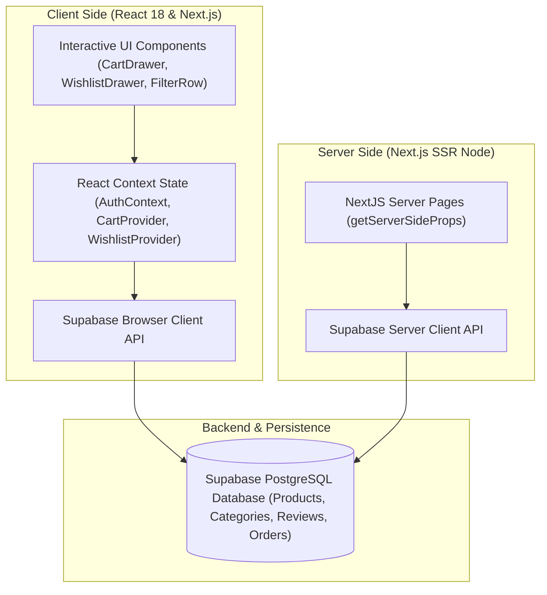

# 🛍️ Fashion Store E-commerce Web Application

  

  
  
  
  

---

## 📖 Introduction
**Fashion Store** is a state-of-the-art, premium e-commerce web application meticulously engineered using **Next.js (Pages Router)**, **TypeScript**, and **Tailwind CSS**. 

The app leverages **Supabase** as its comprehensive backend and database layer, featuring full-scale Context-driven state management for cart/wishlist syncs, responsive swipe-based testimonial carousels, dynamic multi-language routing (**next-intl**), and an elegant, keyboard-accessible design system.

---

## 🗺️ Interactive Table of Contents

  
<b>Click to toggle Table of Contents</b>

  <ul>
    <li><a href="#-architecture--project-structure">🏗️ Architecture & Project Structure</a></li>
    <li><a href="#-interactive-visual-flowchart">📊 Interactive Visual Flowchart</a></li>
    <li><a href="#-premium-interactive-widgets--components">✨ Premium Interactive Widgets & Components</a></li>
    <li><a href="#-modern-technology-stack">🛠️ Modern Technology Stack</a></li>
    <li><a href="#-key-features">🔥 Key Features</a></li>
    <li><a href="#%EF%B8%8F-developer-installation--workflows">⚙️ Developer Installation & Workflows</a></li>
  </ul>

---

## 🏗️ Architecture & Project Structure

Explore the folder structure of **Fashion Store** interactively. Click on any directory below to reveal its architectural responsibilities and key modules:

  
📂 <b><code>components/</code></b> - Reusable UI Modules

  <blockquote>
    Contains clean, highly-reusable React components categorized by functional domains:
    <ul>
      <li><b><code>Header/</code> & <code>Footer/</code>:</b> App-wide navigation headers, mobile menus, and localized footers.</li>
      <li><b><code>Buttons/</code> & <code>Input/</code>:</b> Modular styled interactive input fields and buttons.</li>
      <li><b><code>Card/</code>:</b> Grid components such as product and category cards.</li>
      <li><b><code>CartItem/</code>:</b> Sub-components for products inside drawers and shopping carts.</li>
      <li><b><code>admin/</code>:</b> Dedicated administrative UI modules (analytics, orders list, category managers).</li>
      <li><b><code>TestiSlider/</code>:</b> High-performance touch swipe-compatible review widgets.</li>
    </ul>
  </blockquote>

  
📂 <b><code>context/</code></b> - Application State Management

  <blockquote>
    Houses global React Context APIs orchestrating core application state flows:
    <ul>
      <li><b><code>AuthContext.tsx</code>:</b> Realtime session monitoring and client session distribution using Supabase Auth.</li>
      <li><b><code>cart/</code>:</b> Handles cart item mutations, quantity increases, and persistent cart databases.</li>
      <li><b><code>wishlist/</code>:</b> Keeps track of active user liked items.</li>
    </ul>
  </blockquote>

  
📂 <b><code>hooks/</code></b> - Custom Custom React Hooks

  <blockquote>
    Dedicated directory for encapsulating reusable state and authentication logic:
    <ul>
      <li><b><code>useAdminAuth.ts</code>:</b> Authenticates and secures active admin dashboard sections.</li>
      <li><b><code>useRequireAdmin.ts</code>:</b> Redirect guards for non-administrative requests.</li>
      <li><b><code>useToast.ts</code>:</b> Lightweight dynamic wrapper around <code>react-hot-toast</code>.</li>
    </ul>
  </blockquote>

  
📂 <b><code>lib/</code></b> - Data Fetching & Core Utilities

  <blockquote>
    Core utilities and data-access layer:
    <ul>
      <li><b><code>supabase/</code>:</b> Handles DB initializations, product mapping engines, custom pagination logic, and database schemas:
        <ul>
          <li><code>client.ts</code>: Web client initialization for browser queries.</li>
          <li><code>server.ts</code>: Server-safe Supabase context client initialization.</li>
          <li><code>productQueries.ts</code>: Full-text search and category filtration services.</li>
          <li><code>mapProduct.ts</code>: Normalization layers transforming DB models into clean client-friendly states.</li>
        </ul>
      </li>
      <li><b>Formatting utilities:</b> Format currency conversions (<code>formatInr.ts</code>) and serialize JSON helpers.</li>
    </ul>
  </blockquote>

  
📂 <b><code>messages/</code></b> - Dynamic i18n Locales

  <blockquote>
    Dynamic JSON translation dictionary libraries mapping multi-language localized string assets (e.g., **English** & **Burmese** locales) to keep translations isolated from code.
  </blockquote>

  
📂 <b><code>pages/</code></b> - Next.js Router Views

  <blockquote>
    Routable page layouts structured under Next.js Pages router format:
    <ul>
      <li><b><code>_app.tsx</code> & <code>_document.tsx</code>:</b> Application custom bootstrappers and SEO viewport document structures.</li>
      <li><b><code>index.tsx</code>:</b> Main home page featuring banner slideshows, testimonial sections, and promotional content.</li>
      <li><b><code>checkout.tsx</code>, <code>shopping-cart.tsx</code> & <code>wishlist.tsx</code>:</b> Cart management, checkout gateways, and personalized wishlist zones.</li>
      <li><b><code>product-category/</code>:</b> Dynamic categorization routes supporting filters and order sorting parameters.</li>
      <li><b><code>admin/</code>:</b> Complete administrative analytics platform (categories, coupons, customers, orders, reviews, settings).</li>
    </ul>
  </blockquote>

  
📂 <b><code>styles/</code></b> - Global Design Assets

  <blockquote>
    Houses tailwind configurations, typography fonts, global animation triggers (<code>animate.css</code>), and general layout structures.
  </blockquote>

---

## 📊 Interactive Visual Flowchart

This diagram visualizes how the front-end client, Next.js server components, state management contexts, and the Supabase backend interact seamlessly:

---

## ✨ Premium Interactive Widgets & Components

Fashion Store features several modular interactive UI elements crafted for an immersive user experience. Tap on any widget below to explore its details:

<table>
  <thead>
    <tr>
      <th>Interactive Widget</th>
      <th>Key Features & Interaction Details</th>
    </tr>
  </thead>
  <tbody>
    <tr>
      <td><b>🛒 CartDrawer & WishlistDrawer</b></td>
      <td>
        

          
<b>Click to expand</b>

          <ul>
            <li>Built with <code>@headlessui/react</code> Transition and Dialog panels.</li>
            <li>Smooth slide-over sidebar sheets with full mouse and key navigation.</li>
            <li>Real-time item count indicator badges, quantity triggers, and localized checkouts.</li>
            <li>Synchronized context updates directly reflecting backend cart counts.</li>
          </ul>
        

      </td>
    </tr>
    <tr>
      <td><b>✨ Testimonials Slider</b></td>
      <td>
        

          
<b>Click to expand</b>

          <ul>
            <li>Swiper-based testimonial card deck support with touch gestures and mouse dragging.</li>
            <li>Custom interactive slides illustrating user profile feedback and ratings.</li>
            <li>Responsive layouts optimizing card columns for mobile, tablet, and widescreen viewports.</li>
          </ul>
        

      </td>
    </tr>
    <tr>
      <td><b>🔍 Dynamic FilterRow</b></td>
      <td>
        

          
<b>Click to expand</b>

          <ul>
            <li>High-speed interactive filtering toggling categories (e.g. All, Men, Women, Accessories).</li>
            <li>Pre-matched keyword dictionaries to instantly show items matching the desired targets.</li>
            <li>Micro-animations indicating active selection states.</li>
          </ul>
        

      </td>
    </tr>
    <tr>
      <td><b>📦 ProductCard & Feed</b></td>
      <td>
        

          
<b>Click to expand</b>

          <ul>
            <li>Hover zoom effects with animated layout displays.</li>
            <li>Quick-action drawer shortcuts (e.g. Add to cart directly, quick wishlist updates).</li>
            <li>Integrated skeleton loading screens.</li>
          </ul>
        

      </td>
    </tr>
    <tr>
      <td><b>📢 Announcement Ticker</b></td>
      <td>
        

          
<b>Click to expand</b>

          <ul>
            <li>Autoplay scroll marquis header showing multi-language shipping information.</li>
            <li>Responsive layouts supporting dynamic text sizes.</li>
          </ul>
        

      </td>
    </tr>
  </tbody>
</table>

---

## 🛠️ Modern Technology Stack

| Technology Layer | Framework / Library | Primary Responsibility |
| :--- | :--- | :--- |
| **Core Framework** | `Next.js 14` (Pages Router) | Pre-rendered SSR pages, SEO, Server-Side DB connections. |
| **Programming Language** | `TypeScript` | Full-stack types, component props safety, and data models. |
| **Backend / Database** | `@supabase/supabase-js` | PostgreSQL storage, real-time sync, auth rules, and client APIs. |
| **Styling & Theme** | `Tailwind CSS` & `Autoprefixer` | Utilitarian design system, grid, HSL palettes, and fluid layouts. |
| **Internationalization** | `next-intl` | Multi-language translation layer (English & Burmese). |
| **UI Components** | `@headlessui/react` & `Lucide Icons` | Accessible dialogue panels, sliders, and lightweight vectors. |
| **Visualization** | `Recharts` | Elegant analytics display in the Admin dashboard. |
| **State Handling** | `React Context API` | State distribution (Auth contexts, Cart drawer caches, etc.). |

## 🔥 Key Features

- **Progressive Web App (PWA)**: Installable like a native app on mobile and desktop platforms.
- **Robust Supabase Integration**: Cloud PostgreSQL db, lightning-fast queries, and pre-mapped response engines.
- **Unified Internationalization (i18n)**: Fully dynamic switching between languages (English & Burmese).
- **Responsive Layout Architecture**: Flawless visual grids adapted for screens ranging from small smartphones to massive desktops.
- **Powerful Admin Dashboard**: Analytics widgets powered by `recharts` to monitor products, reviews, active coupon codes, orders, and customer activities.

---

## ⚙️ Developer Installation & Workflows

Follow this interactive workspace launcher guide to run **Fashion Store** locally:

  
<b>1. Clone & Initialize</b>

  <blockquote>
    Clone the source code and clean out the default repository links:
    <pre><code class="language-bash"># Clone repository
git clone https://github.com/satnaing/e-commerce.git

# Enter project root
cd e-commerce

# Reset Git origin links if needed
git remote remove origin</code></pre>
  </blockquote>

  
<b>2. Set Up Environment Variables</b>

  <blockquote>
    Create a local configuration file named <code>.env.local</code> inside the root directory and specify your Supabase configurations:
    <pre><code class="language-env">NEXT_PUBLIC_SUPABASE_URL=your_supabase_project_url
NEXT_PUBLIC_SUPABASE_ANON_KEY=your_supabase_anon_public_key
SUPABASE_SERVICE_ROLE_KEY=your_supabase_service_role_key</code></pre>
  </blockquote>

  
<b>3. Install Dependencies & Boot Server</b>

  <blockquote>
    Fashion Store works seamlessly using standard package managers:
    <pre><code class="language-bash"># Install packages
npm install

# Run the development environment
npm run dev</code></pre>
    Once started, navigate to <a href="http://localhost:3000">http://localhost:3000</a> to view the store locally.
  </blockquote>

  
<b>4. Production Build & Deployment</b>

  <blockquote>
    To package a high-performance production build:
    <pre><code class="language-bash"># Run builds and static generations
npm run build

# Start production server
npm run start</code></pre>
  </blockquote>

  
<b>5. Running with Docker Containerization</b>

  <blockquote>
    Fashion Store is container-ready. Build and run via Docker easily:
    <pre><code class="language-bash"># Build the docker container
docker build -t fashion-store .

# Start the docker container
docker run -p 3000:3000 fashion-store</code></pre>
  </blockquote>

